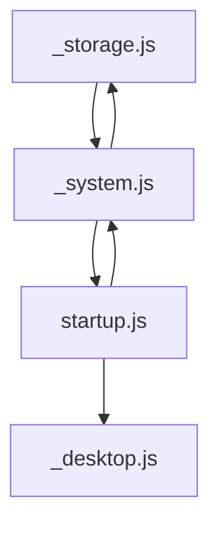
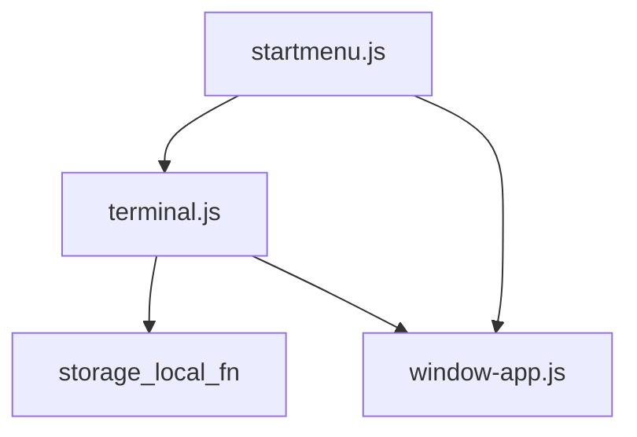

# bored_html_stuff

Estava avorrit i vaig fer aixo Xd

```mermaid
graph TD;
    _storage.js -->  _system.js;
    _system.js -->  _storage.js ;
    _system.js-->startup.js;
    startup.js-->_system.js;
    startup.js-->_desktop.js;
```

```mermaid
graph TD;
    startmenu.js -->  terminal.js;
    terminal.js -->  storage_local_fn;
    startmenu.js -->  window-app.js;
    terminal.js -->  window-app.js;
```